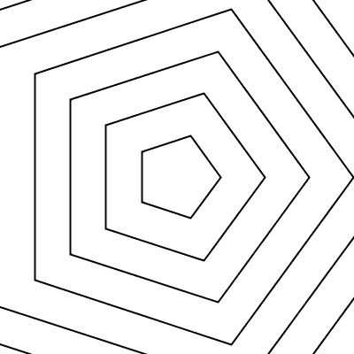

# Geometric gifs - made with Processing 3.0 and the gifAnimation lib  
> Matthias experiments in programming animated geometric graphics for Ulrich Armin Reiterer.

## Examples
Latest:

## Rendering
[http://p5js.org/](http://p5js.org/)
p5*js - a library for rendering graphics in a `<canvas>`

## Typography
[https://developers.google.com/fonts/](https://developers.google.com/fonts/)
The Google Font Api provides a large number of font-families as `<option>` in a `<select>`

# Thanks for beeing here, you are awsome!
> Let's stay in touch! Pulls, forks and stars are welcome

https://github.com/matthias-jaeger-net/glypher
