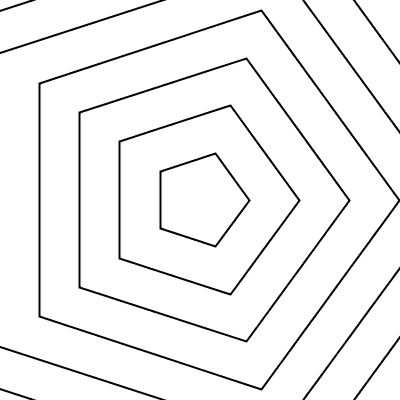

# Geometric gifs - made with Processing 3.0 and the gifAnimation lib  
> Matthias experiments in programming animated geometric graphics for Ulrich Armin Reiterer.

## Examples

### Untitled, 400x400

### Untitled, 400x400

### Untitled, 400x400

### Untitled, 400x400

### Untitled, 400x400

## Rendering
[http://processing.org/](http://p5js.org/)
Processing is a library for rendering graphics in a `PApplet`

# Thanks for beeing here, you are awsome!
> Let's stay in touch! Pulls, forks and stars are welcome

https://github.com/matthias-jaeger-net/glypher
